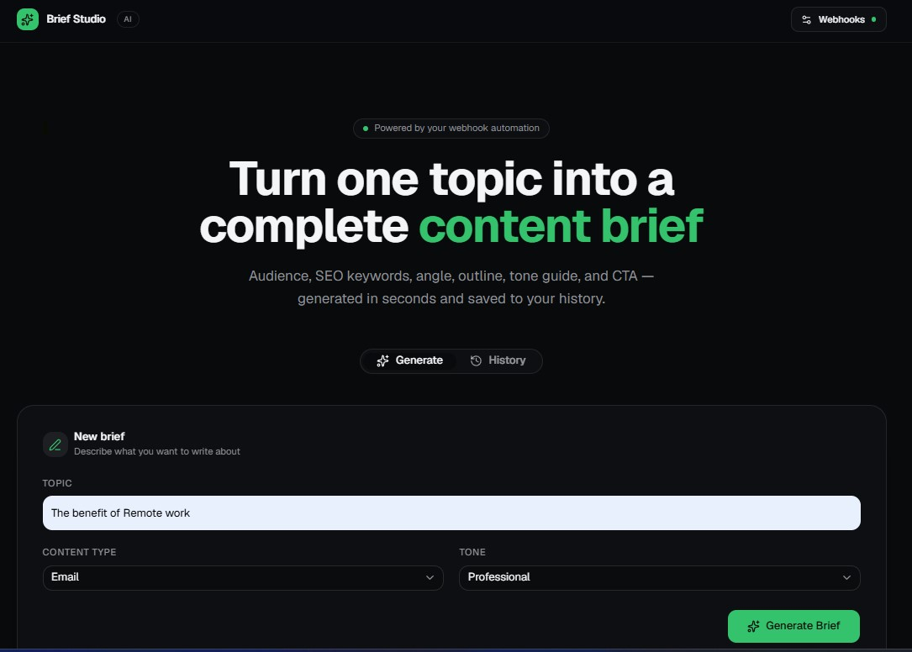
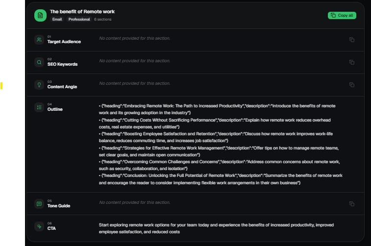
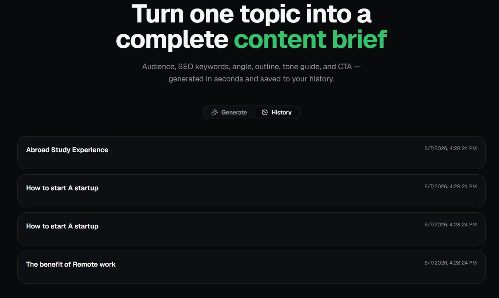
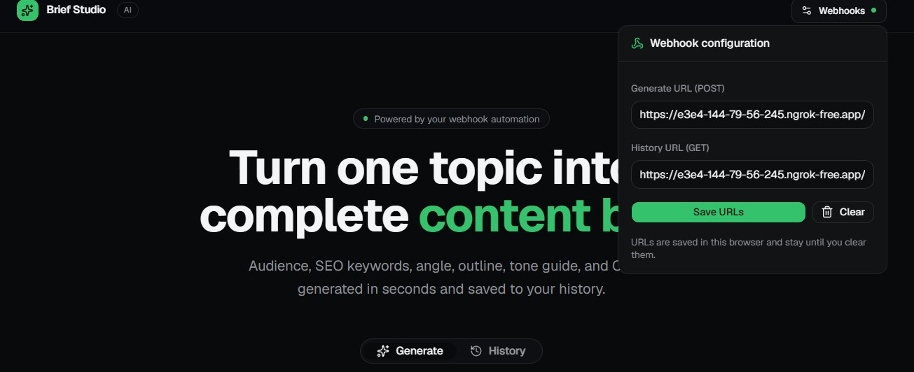
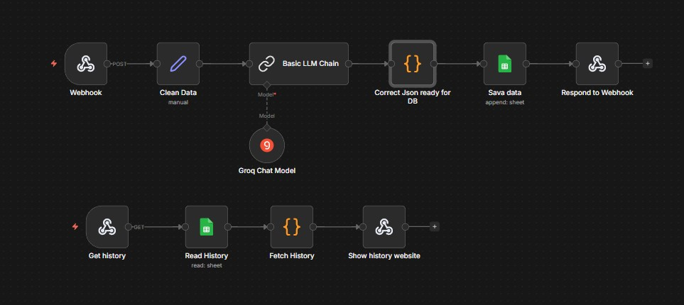
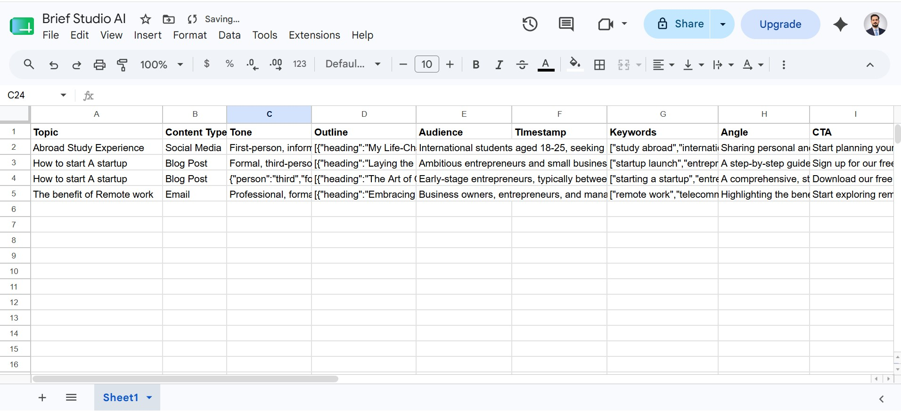
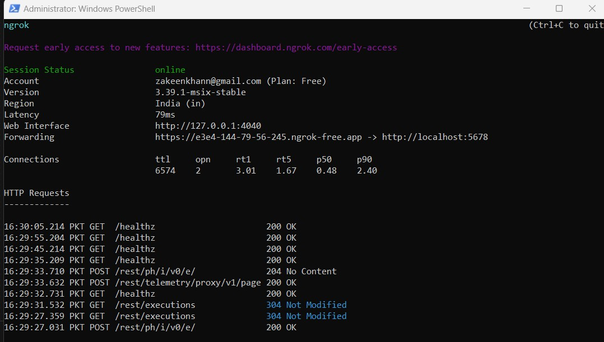
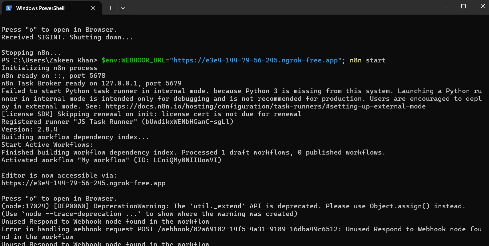
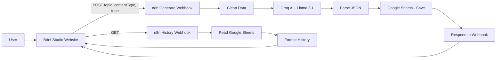

# Brief Generator AI (Brief Studio)

Turn **one topic** into a **full content brief** in seconds — audience, SEO keywords, angle, outline, tone guide, and CTA.

This project connects a **Next.js website** (Brief Studio) with an **n8n automation workflow** and **Google Sheets** storage. You type a topic, AI creates the brief, and everything is saved to your history.

---

## Screenshots

### 1. Main website — enter a topic and generate



### 2. Generated content brief — 6 sections ready to copy



### 3. History tab — see all past briefs



### 4. Webhook settings — connect the website to n8n



### 5. n8n backend workflow — the automation brain



### 6. Google Sheets — every brief saved automatically



### 7. ngrok — expose local n8n to the internet



### 8. Local setup — run n8n on your computer



---

## What does this project do?

Imagine you want to write a blog post, email, or social media post — but you don't know where to start.

**Brief Studio** helps you by:

1. Asking for a **topic** (example: *"The benefit of Remote work"*)
2. Asking for a **content type** (Blog Post, Email, or Social Media)
3. Asking for a **tone** (Professional, Casual, or Friendly)
4. Sending that info to **AI** (via n8n + Groq)
5. Getting back a **complete brief** with 6 parts:
   - Target Audience
   - SEO Keywords
   - Content Angle
   - Outline (headings + descriptions)
   - Tone Guide
   - Call to Action (CTA)
6. **Saving** every brief to Google Sheets so you can view history later

---

## How it works — step by step

### Step 1: You open the website

Open **Brief Studio** in your browser. You see a simple form with Topic, Content Type, and Tone.

### Step 2: You connect your webhooks (one-time setup)

Click **Webhooks** in the top-right corner and paste two URLs from your n8n workflow:

| Field | Method | Purpose |
|-------|--------|---------|
| **Generate URL** | `POST` | Creates a new content brief |
| **History URL** | `GET` | Loads past briefs from Google Sheets |

These URLs are saved in your browser until you clear them.

### Step 3: You click "Generate Brief"

The website sends your topic, content type, and tone to the **Generate webhook** in n8n.

**Example JSON sent to n8n:**

```json
{
  "topic": "The benefit of Remote work",
  "contentType": "Email",
  "tone": "Professional"
}
```

### Step 4: n8n cleans the data

The **Clean Data** node in n8n reads the webhook body and maps it to three fields:

- `Topic`
- `ContentType`
- `Tone`

### Step 5: AI creates the brief (Groq + Llama)

The **Basic LLM Chain** node sends a prompt to **Groq** (model: `llama-3.1-8b-instant`).

The AI is instructed to return **only JSON** with exactly these 6 keys:

```json
{
  "audience": "Who the content is for...",
  "keywords": ["keyword1", "keyword2", "keyword3", "keyword4", "keyword5"],
  "angle": "The unique hook or perspective...",
  "tone": "Writing style description...",
  "outline": [
    { "heading": "H1 — main title", "description": "What this section covers" },
    { "heading": "H2 — subheading", "description": "..." }
  ],
  "cta": "One actionable call-to-action sentence"
}
```

### Step 6: n8n fixes and parses the JSON

The **Correct Json ready for DB** node removes any markdown code fences (like ` ```json `) and parses the AI response into clean JSON.

### Step 7: Data is saved to Google Sheets

The **Sava data** node appends a new row to your **Brief Studio AI** Google Sheet with columns:

| Column | Source |
|--------|--------|
| Topic | From your form input |
| Content Type | From your form input |
| Tone | From AI response |
| Outline | From AI response |
| Audience | From AI response |
| Keywords | From AI response |
| Angle | From AI response |
| CTA | From AI response |

### Step 8: n8n sends the brief back to the website

The **Respond to Webhook** node returns the JSON to Brief Studio. The website displays all 6 sections in cards you can copy.

### Step 9: View history anytime

When you open the **History** tab, the website calls the **History webhook** (`GET /history`).

That flow:

1. **Get history** webhook receives the request
2. **Read History** reads all rows from Google Sheets
3. **Fetch History** formats the data for the website
4. **Show history website** sends the list back

---

## System architecture



---

## n8n workflow file

The full automation is in:

**[`Ai Content Creator.json`](./Ai%20Content%20Creator.json)**

Import this file into n8n: **Workflows → Import from File**

### Workflow 1 — Generate brief (POST)

```
Webhook (POST /zakeen)
  → Clean Data
  → Basic LLM Chain (+ Groq Chat Model)
  → Correct Json ready for DB
  → Sava data (Google Sheets append)
  → Respond to Webhook
```

### Workflow 2 — Load history (GET)

```
Get history (GET /history)
  → Read History (Google Sheets read)
  → Fetch History (JavaScript format)
  → Show history website (Respond to Webhook)
```

---

## Tech stack

| Part | Technology |
|------|------------|
| Frontend | Next.js 16, React 19, Tailwind CSS, shadcn/ui |
| Backend automation | n8n (self-hosted) |
| AI model | Groq — Llama 3.1 8B Instant |
| Database / storage | Google Sheets |
| Public tunnel (local dev) | ngrok |
| Package manager | pnpm |

---

## Project files

```
Brief Generator AI/
├── README.md                      ← You are here
├── Ai Content Creator.json        ← n8n workflow (import this)
├── ai-content-brief-generator.zip ← Frontend app source
├── screenshots/                   ← README images
├── app/                           ← Next.js pages and API routes
│   ├── page.tsx                   ← Main Brief Studio UI
│   └── api/
│       ├── generate/route.ts      ← Forwards POST to n8n webhook
│       └── history/route.ts       ← Forwards GET to n8n history webhook
├── components/                    ← UI components (form, results, history)
├── hooks/use-webhook-config.ts    ← Saves webhook URLs in browser
└── lib/brief.ts                   ← Parses AI response into 6 sections
```

---

## Setup guide — run it yourself

### What you need

- [Node.js](https://nodejs.org/) (v18 or newer)
- [pnpm](https://pnpm.io/)
- [n8n](https://n8n.io/) installed locally or on a server
- A [Groq API](https://console.groq.com/) account
- A Google account (for Google Sheets)
- [ngrok](https://ngrok.com/) (for local development)

---

### Part A — Set up Google Sheets

1. Create a new Google Sheet named **Brief Studio AI**
2. Add these column headers in row 1:

   `Topic | Content Type | Tone | Outline | Audience | Timestamp | Keywords | Angle | CTA`

3. Connect Google Sheets in n8n (OAuth2 credentials)

---

### Part B — Set up n8n

1. Install and start n8n:

   ```powershell
   n8n start
   ```

2. Open n8n at `http://localhost:5678`

3. Import **`Ai Content Creator.json`**

4. Connect your credentials:
   - **Groq account** → Groq Chat Model node
   - **Google Sheets account** → Read History and Sava data nodes

5. Update the Google Sheet ID in both Google Sheets nodes if you use your own sheet

6. **Activate** the workflow

7. Copy your webhook URLs:
   - Generate: `POST` → `/webhook/zakeen` (or your path)
   - History: `GET` → `/webhook/history`

---

### Part C — Expose n8n with ngrok (local dev)

n8n runs on your computer. The website needs a public URL to reach it.

1. Start ngrok:

   ```powershell
   ngrok http 5678
   ```

2. Copy the HTTPS URL (example: `https://xxxx.ngrok-free.app`)

3. Start n8n with the webhook base URL:

   ```powershell
   $env:WEBHOOK_URL="https://xxxx.ngrok-free.app"; n8n start
   ```

4. Your full webhook URLs will look like:

   ```
   https://xxxx.ngrok-free.app/webhook/zakeen      ← Generate (POST)
   https://xxxx.ngrok-free.app/webhook/history     ← History (GET)
   ```

---

### Part D — Run the website

1. Extract or clone the frontend app

2. Install dependencies:

   ```bash
   pnpm install
   ```

3. Start the dev server:

   ```bash
   pnpm dev
   ```

4. Open `http://localhost:3000`

5. Click **Webhooks** and paste your Generate URL and History URL

6. Enter a topic and click **Generate Brief**

---

## API reference

### Website → n8n (Generate)

**POST** to your n8n webhook URL

**Request body:**

```json
{
  "topic": "Your topic here",
  "contentType": "Blog Post",
  "tone": "Professional"
}
```

**Response:** JSON brief with `audience`, `keywords`, `angle`, `tone`, `outline`, and `cta`

---

### Website → n8n (History)

**GET** to your n8n history webhook URL

**Response:**

```json
{
  "history": [
    {
      "topic": "The benefit of Remote work",
      "content": "...",
      "date": "2026-06-07T..."
    }
  ]
}
```

---

## Content types and tones

**Content types:**
- Blog Post
- Email
- Social Media

**Tones:**
- Professional
- Casual
- Friendly

---

## Tips

- **Webhook URLs change** when you restart ngrok on the free plan. Update them in the Webhooks settings each time.
- **Activate the workflow** in n8n before testing — inactive workflows won't respond.
- Use **Copy all** on the results page to paste the full brief into Docs, Notion, or your CMS.
- The Google Sheet is your **permanent record** — even if you clear browser history, data stays in the sheet.

---

## Author

Built by **Zakeen Khan** as an AI automation project using n8n, Groq, and Next.js.

---

## License

This project is open source. Feel free to use, modify, and share it.
